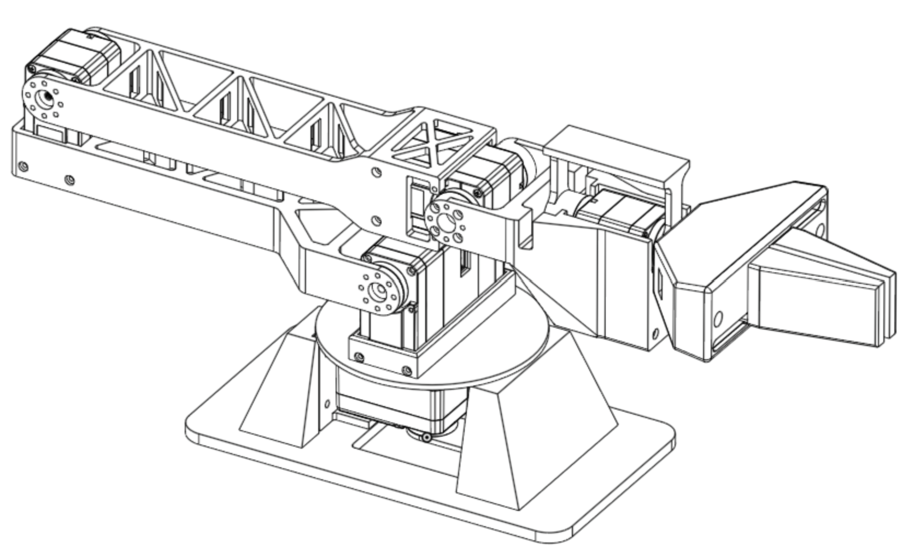

  

# Dahlia
**Dahlia** is a open-source, 5+1 DOF robotic arm designed for small scale pick and place, educational, and data collection tasks.

  

The primary inspiration for the design was the [LeRobot and Huggingface SO-101](https://huggingface.co/docs/lerobot/en/so101) open-source robotic arm, and the [HiWonder NexArm](https://www.hiwonder.com/products/nexarm). The goal of the project was to design an open-source arm with 3D-printable hardware, at a fairly accessible price, while improving upon the specifications of the SO-101 and similar arms in terms of load capacity, reach, and form factor.

## Design, Stack, and BOM
The full CAD design for the Dahlia arm were created using OnShape and a bit of Autodesk Fusion. All editable CAD files are available on the [OnShape Document](https://cad.onshape.com/documents/8e567048457d8f314f3cf9ea/w/dc4364e539049e2561969525/e/322bc6f20473a79fe384e2b4). HiWonder bus servos were chosen to be the main actuators for the design due to their relatively low cost for power trade off, and a 

A full bill of materials needed to construct the arm is listed below. *Note that some manufacturing and connective equipment, such as a 3D printer (BambuLab X2D was used for all prints in construction), hex keys, soldering iron and USB-C cabling are not included.*
| **Component**               | **Link**                                                                                                   | **Units** |       **Price (at time)** | **Total Price** |
| --------------------------- | ---------------------------------------------------------------------------------------------------------- | --------: | --------------: | --------------: |
| Hiwonder HX-30HM            | [Hiwonder](https://www.hiwonder.com/products/hx-30hm?variant=42135141253207)                               |         4 |          $19.99 |          $79.96 |
| Hiwonder HX-65HM            | [Hiwonder](https://www.hiwonder.com/products/hx-65hm?variant=42066913132631)                               |         1 |          $49.99 |          $49.99 |
| Hiwonder BusLinker v3       | [Hiwonder](https://www.hiwonder.com/products/buslinker)                                                    |         1 |           $9.99 |           $9.99 |
| Hiwonder LFD-01M            | [Hiwonder](https://www.hiwonder.com/products/lfd-01m?variant=39328236896343)                               |         1 |           $6.99 |           $6.99 |
| Arduino UNO Q 4GB           | [Arduino](https://store-usa.arduino.cc/pages/uno-q)                                                        |         1 |          $59.99 |          $59.99 |
| M3 Heat Set Inserts         | [Amazon](https://www.amazon.com/Threaded-Inserts-Plastic-3mm-10mm-Pringting/dp/B0FD88XTV4/)                |         1 |           $9.99 |           $9.99 |
| M3 Screws                   | [Amazon](https://www.amazon.com/Fgruh-750PCS-Assortment-Washers-Assorted/dp/B0FGV5FCBN/)                   |         1 |           $9.99 |           $9.99 |
| M2 Screws                   | [Amazon](https://www.amazon.com/Fgruh-1260pcs-M2-Assortment-Stainless/dp/B0FG2CC91J/)                      |         1 |           $9.99 |           $9.99 |
| Logitech C270 Webcam        | [Amazon](https://www.amazon.com/Logitech-Desktop-Widescreen-Calling-Recording/dp/B004FHO5Y6)               |         1 |          $16.89 |          $16.89 |
| 9V Barrel Jack Power Supply | [Amazon](https://www.amazon.com/Interchangeable-Switching-Compatible-Universal-Electronics/dp/B0CPPPKP91/) |         1 |           $9.99 |           $9.99 |
|                             |                                                                                                            |           | **Total Cost:** |     **$263.77** |
> [!NOTE]
> A [HiWonder bus servo controller](https://www.hiwonder.com/products/serial-bus-servo-controller) instead of a BusLinker and Arduino UNO Q setup, to directly command the arm from a local computer, may be more cost-efficient and effective for some applications.

## Assembly and Setup
To assemble the arm, acquire the components listed in the BOM, and print the 3D-printable components in the hardware `.step` files for each section of the arm, using any 3D printer (around 0.5kg of PLA filament should be sufficient).

## Usage

## Add-Ons

## Notes and Acknowledgements
Dahlia was designed in part for the "Invent the Future with Arduino UNO Q and App Lab" challenge, hosted by [Hackster.io](https://www.hackster.io/contests/invent-the-future-with-arduino-uno-q-and-app-lab). Thank you to Hackster.io for providing the Arduino UNO Q hardware that was used to design and construct the project.

> [!NOTE]
> As the first project for the Psymatronics Lab, there is definitely more extension to be done on Dahlia and much was learned from designing and troubleshooting the arm. I hope to continue to build out the software stack of Dahlia, and begin designing **Dahlia II**, which will be an enhanced arm, designed for low-cost research and data-collection applications.